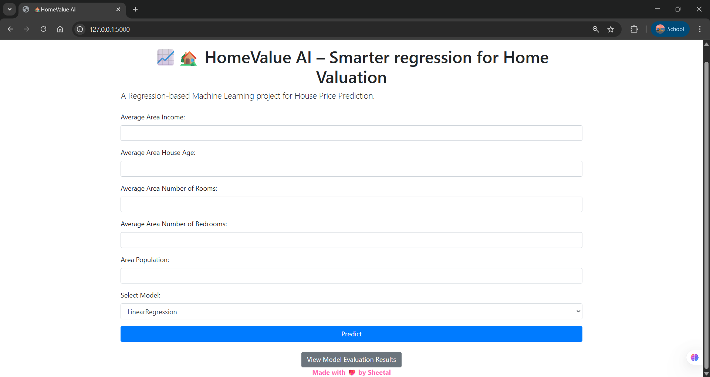
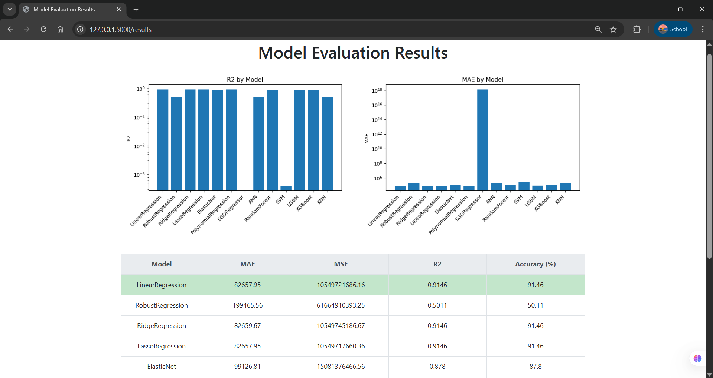
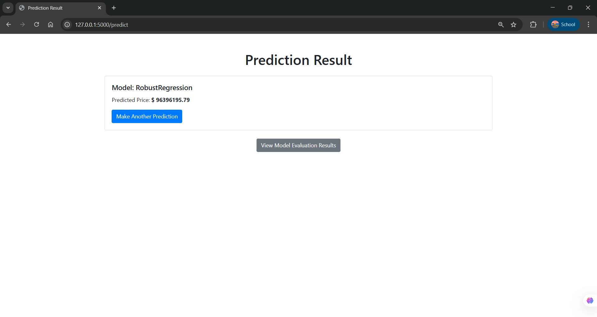

# 🏡📈 HomeValue AI – Smarter regression for Home Valuation

📈 **PricePredictor** is a Regression-based Machine Learning project for **House Price Prediction**.
It allows users to select different ML models, input features (like income, house age, rooms, etc.), and predict house prices instantly through a Flask web application.

---

## ✨ Features

- 🔮 Predict house prices using multiple regression models:
  - Linear Regression, Ridge, Lasso, ElasticNet, Polynomial Regression
  - RandomForest, SVM, KNN
  - Advanced models: ANN, XGBoost, LightGBM, SGD Regressor, Robust Regression
- 📊 Model evaluation with **MAE, MSE, R², and Accuracy (%)**
- 🌟 Highlights the **best model** based on R²
- 📉 Beautiful graphs for comparison:
  - R² scores by model
  - MAE scores by model
  - MSE scores by model
- 💾 All trained models are saved as `.pkl` files for reuse
- 🖥️ Interactive **Flask Web App** with a Bootstrap frontend
- ❤️ "Made with 💖 by Sheetal" branding at the bottom

---

## 📂 Project Structure

```
PricePredictor/
│
├── main.py                         # Training script – trains models & saves evaluation results
├── app.py                        # Flask web app backend
├── model_evaluation_results.csv  # Model evaluation results
├── templates/                    # HTML templates
│   ├── index.html                # Homepage with form
│   ├── results.html              # Predicted price page
│   └── model.html                # Model evaluation results with graphs
├── ANN.pkl
├── ElasticNet.pkl
├── KNN.pkl
├── LassoRegression.pkl
├── LGBM.pkl
├── LinearRegression.pkl
├── PolynomialRegression.pkl
├── RandomForest.pkl
├── RidgeRegression.pkl
├── RobustRegression.pkl
├── SGDRegressor.pkl
├── SVM.pkl
├── XGBoost.pkl
├── Workflow.txt
├── static/                       # Static files (CSS, JS, images, plots)
│   └── plots/                    # Plots (r2.png, mae.png, mse.png)
└── README.md                     # Project documentation
```

---

## ⚙️ Workflow

1. **Train Models**Run `main.py` → trains multiple regression models, evaluates them, saves models as `.pkl`, and generates graphs.
2. **Start Flask App**Run `app.py` → loads trained models + results, serves web interface.
3. **User Interaction**

   - Input house details (income, rooms, population, etc.)
   - Select model from dropdown
   - Get predicted house price instantly.
4. **Evaluation Page**

   - View model comparison table
   - See graphs of R², MAE, MSE
   - Best model is highlighted.

---

## 🖼️ Screenshots

### 🏠 Homepage (Input Form)



### 📊 Model Evaluation Results



### 💵 Prediction Result



---

## 🛠️ Installation & Setup

### 1️⃣ Clone the Repository

```bash
git clone https://github.com/sheetalkothari13/HomeValue-AI-Smarter-regression-for-Home-Valuation.git
```

### 2️⃣ Install Dependencies

```bash
pip install -r requirements.txt
```

**requirements.txt**

```
flask
pandas
scikit-learn
matplotlib
xgboost
lightgbm
```

### 3️⃣ Train Models

```bash
python main.py
```

This will:

- Train all models
- Save `.pkl` files
- Generate `model_evaluation_results.csv`
- Save plots in `static/plots/`

### 4️⃣ Run Flask App

```bash
python app.py
```

Go to 👉 **http://127.0.0.1:5000/**

---

## 🚀 Future Improvements

- 🔎 Add cross-validation results
- 📈 Add interactive graphs (Plotly/Dash)
- 🏆 Auto-select best model for prediction
